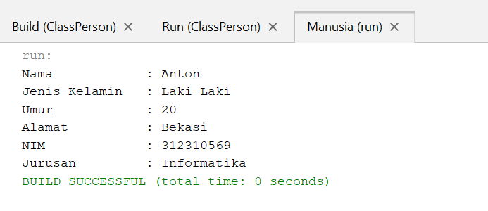
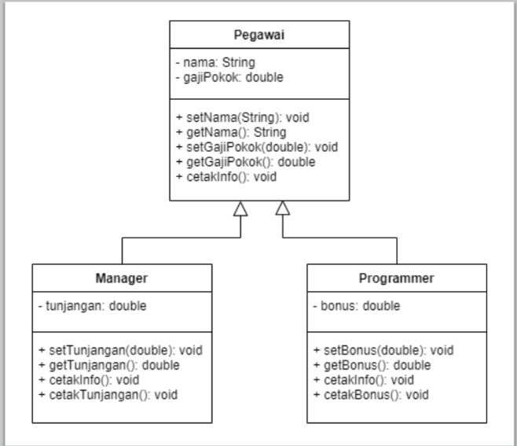
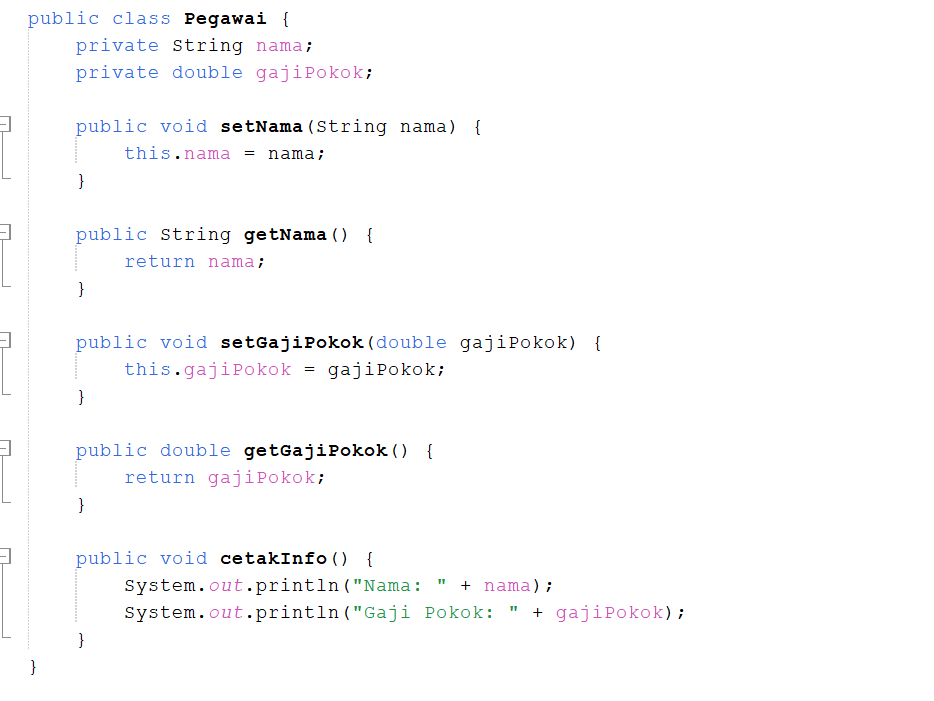
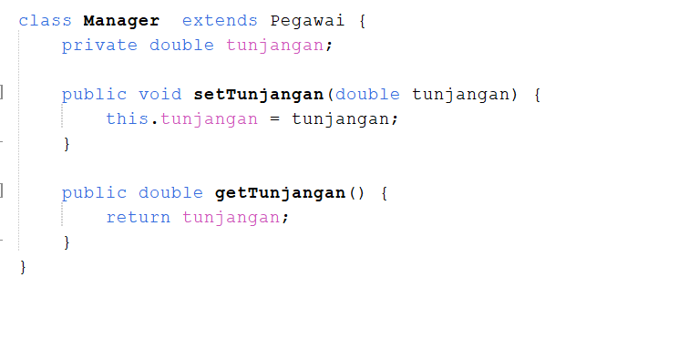
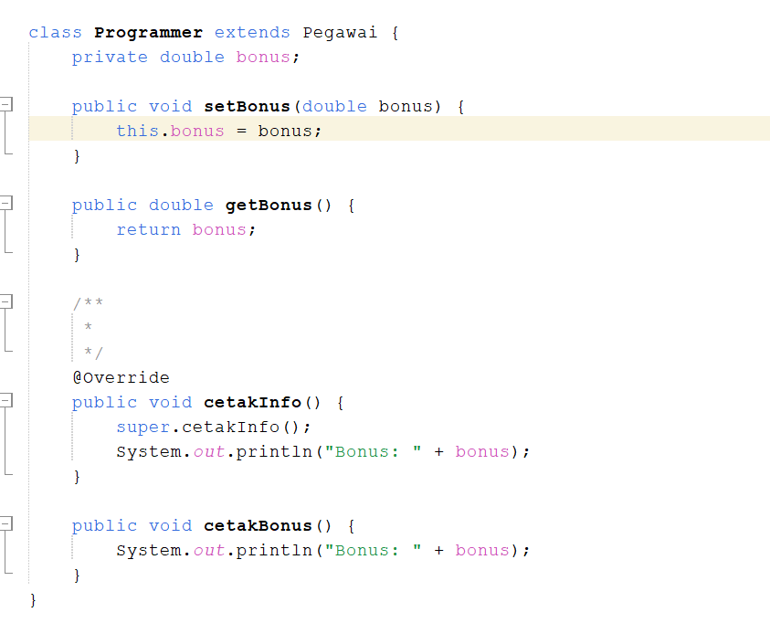
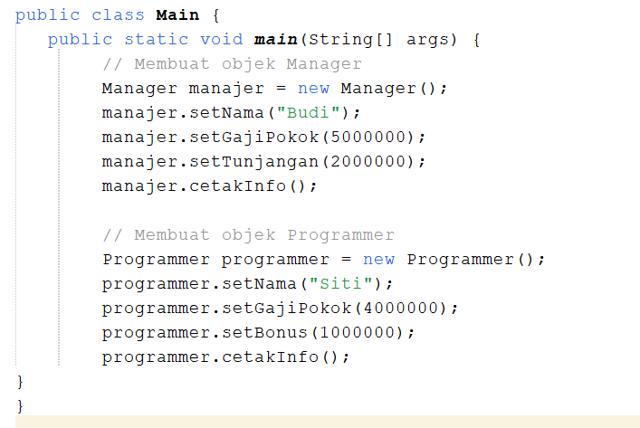
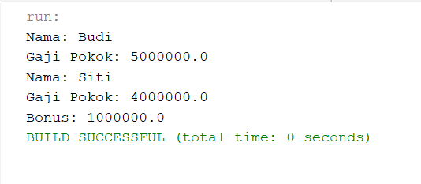

# Praktikum_3
## - Lengkapi latihan class Mahasiswa dengan setter dan getter
public class Mahasiswa extends Manusia {
    String nim;
    String jurusan;

    public Mahasiswa(String nama, String jenisKelamin, int umur, String alamat, String nim, String jurusan) {
        super(nama, jenisKelamin, umur, alamat);
        this.nim = nim;
        this.jurusan = jurusan;
    }

    // Getter dan Setter untuk Mahasiswa
    public String getNim() {
        return nim;
    }

    public void setNim(String nim) {
        this.nim = nim;
    }

    public String getJurusan() {
        return jurusan;
    }

    public void setJurusan(String jurusan) {
        this.jurusan = jurusan;
    }
} 
## *Penjelasan
Kelas Mahasiswa
Kelas Mahasiswa ini adalah subclass dari kelas Manusia. Kelas ini memperluas kelas Manusia dengan menambahkan atribut khusus yang hanya dimiliki oleh mahasiswa, yaitu nim (Nomor Induk Mahasiswa) dan jurusan.

Atribut:
String nim: Untuk menyimpan Nomor Induk Mahasiswa.
String jurusan: Untuk menyimpan informasi jurusan dari mahasiswa tersebut.

Hubungan dengan Kelas Manusia
Kelas Mahasiswa adalah subclass yang mewarisi atribut dan metode dari superclass Manusia. Artinya, objek Mahasiswa dapat mengakses atribut dan metode dari Manusia seperti nama, jenisKelamin, umur, dan alamat, serta menggunakan metode yang ada di kelas Manusia.

Kesimpulan:
Kelas ini memungkinkan untuk membuat objek mahasiswa yang memiliki informasi seperti nama, jenis kelamin, umur, alamat, nim, dan jurusan. Setiap objek Mahasiswa dapat mengubah atau mendapatkan informasi tersebut menggunakan getter dan setter.

# Hasil Output

## - Implementasikan java code diagram pada class berikut:

- Menampilkan class Pegawai
  

- Menampilkan Class Manager
  

  
- Menampilkan Class Programmer
  

- Menampilkan class Main
  

Pada implementasi ini, class Manager dan Programmer mewarisi atribut dan metode dari class Pegawai. Mereka juga menambahkan atribut baru yaitu tunjangan untuk Manager dan bonus untuk Programmer, dengan metode setter, getter, dan metode tambahan untuk mencetak informasi yang relevan.

## Hasil Output

